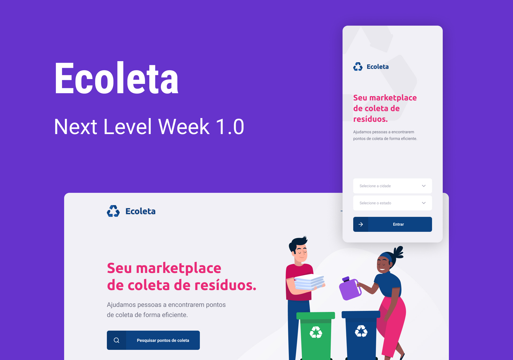

<h1 align="center">
    
</h1>

<h4 align="center">
  🚀 Next Level Week #01
</h4>

 

  

## :rocket: Technologies

This project was developed with the following technologies:

- [Node.js](https://nodejs.org/en/)
- [React](https://reactjs.org)
- [React Native](https://facebook.github.io/react-native/)
- [Expo](https://expo.io/)

## 💻 Project

Developed at Next Level Week # 01, Ecoleta is a project in favor of facilitating the population's access to selective waste collection points, where lamps, cooking oil, batteries, etc. are collected at these points.
With the correct disposal of waste we can further extend the life of our planet.

